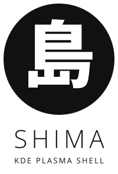
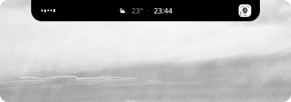
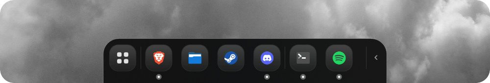
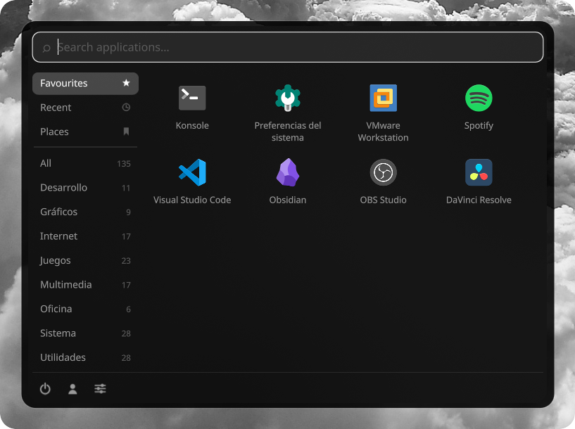

<p align="center">
  <picture>
    <source media="(prefers-color-scheme: dark)" srcset="assets/logo-vertical-white.svg">
    
  </picture>
</p>

<p align="center">Dynamic island and dock for KDE Plasma on Wayland.</p>

An island anchored to the top edge showing media, time and volume, and a
dock growing from the bottom edge. Written in QML on top of
[Quickshell](https://quickshell.org), using `wlr-layer-shell` and the
system's native services.

## What it does

**Island.** Collapsed it shows an audio visualiser, the clock and the
album art. Hovering expands it into one of four modes, switched with the
scroll wheel or by clicking the dots:

- **Media** — album art, track and transport controls
- **Control centre** — Wi-Fi, Bluetooth, mute and volume
- **Status** — CPU, memory and network throughput
- **Calendar** — month view with a pomodoro timer

<p align="center">
  
</p>

**Dock.** Pinned apps inherited from your Plasma task manager, plus the
apps you currently have open, separated by a divider. Drag to reorder,
right click to pin or unpin, and an optional launcher button opening a
categorised application grid with search.

<p align="center">
  
</p>

**Launcher.** Favourites, categories and places, taken from KDE's own
menu and kept in step with it: favourite something in either and it
shows up in the other. Recent applications and recent files. Search
across applications, files and a calculator, KRunner-style. Bound to
the Meta key by default.

<p align="center">
  
</p>

**Notifications.** A server of its own, shown on the island or as a
card, with history, do not disturb, and silencing during a focus
session.

**Settings.** Right click the dock. Position, auto-hide, opacity,
background blur, corner radius, icon shape and size, accent colour,
per-monitor placement, per-monitor brightness, night light, power
profile and keeping the machine awake. Language: English, Spanish,
Catalan, French, German, Italian, Portuguese and Japanese. Everything
applies live.

## Installing

### Arch, CachyOS and derivatives

```bash
paru -S shima-shell   # or: yay -S shima-shell
```

### Everywhere else

```bash
curl -fsSL https://raw.githubusercontent.com/ayozetr/shima-shell/main/install.sh | sh
```

One command. It works out what your distribution needs, asks before
installing anything, and puts Shima in `~/.local`.

To have it start with your session, add `--autostart`:

```bash
curl -fsSL https://raw.githubusercontent.com/ayozetr/shima-shell/main/install.sh | sh -s -- --autostart
```

## Uninstalling

Run this first, while Shima is still installed — it hands the Meta key
back to Plasma:

```bash
shima --cleanup
```

Then remove it the way you installed it:

```bash
paru -R shima-shell         # or
./install.sh --uninstall    # this one runs --cleanup for you
```

## Also worth having

Not needed, and nothing here depends on them. Just good projects.

- **[Darkly](https://github.com/Bali10050/Darkly)** — Qt style and window decoration
- **[KDE Rounded Corners](https://github.com/matinlotfali/KDE-Rounded-Corners)** — rounded corners on every window
- **[Papirus](https://github.com/PapirusDevelopmentTeam/papirus-icon-theme)** — icon theme, the one Shima draws from

## Origin

Shima Shell is an independent project, unaffiliated with the Bloom
project or its authors, but it started out inspired by
[Bloom](https://github.com/SehajveerSingh2005/bloom), which does
something similar on Windows. The code is its own: Bloom is a Tauri
application with a Rust backend written against the Windows APIs, which
have no direct equivalent on Wayland.

## Support

Shima is free and always will be. If it is useful to you and you feel
like it: [ko-fi.com/ayozetr](https://ko-fi.com/ayozetr).

## License

### The code

Copyright © 2026 ayozetr

This program is free software: you can redistribute it and/or modify it
under the terms of the GNU General Public License, version 3, as
published by the Free Software Foundation.

This program is distributed in the hope that it will be useful, but
WITHOUT ANY WARRANTY; without even the implied warranty of
MERCHANTABILITY or FITNESS FOR A PARTICULAR PURPOSE. See the
[GNU General Public License](LICENSE) for more details.

### The assets

Everything under `assets/` — the name, the icon and the logotype — is
**not** covered by the GPL. All rights are reserved by the author.

They may be used in forks made to contribute back to this project —
see [CONTRIBUTING](CONTRIBUTING.md) — but not in an independent one.

Publishing a modified Shima as a product of its own, under this name
and with these assets, is not permitted. The code itself stays under
the GPL.
